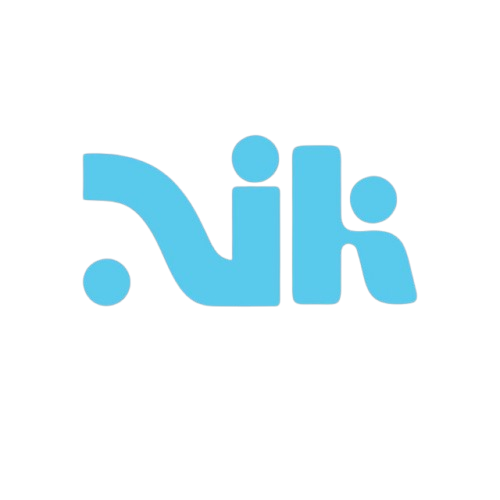

<p align="center">
  
</p>

<h1 align="center">Aiki Frontend</h1>

<p align="center">
  Open-source Web3 education infrastructure for courses, learner dashboards, blockchain certificates, and learning rewards.
</p>

<p align="center">
  <strong>Built for Web3 learning today, with a roadmap toward Stellar payments and Soroban-powered certificate verification.</strong>
</p>

---

## Overview

Aiki is an open-source Web3 education platform designed to help instructors create courses, learners track progress, and communities issue verifiable blockchain-based certificates.

This repository contains the frontend application for the Aiki platform.

## Problem

Online learning platforms often make it difficult for learners to prove course completion, for instructors to manage transparent learning records, and for communities to reward meaningful learning activity.

## Solution

Aiki provides a modern, wallet-ready learning interface that can support:

- Course discovery
- Learner enrollment
- Instructor dashboards
- Learner dashboards
- Progress tracking
- Certificate verification
- Future Stellar/Soroban payment and reward flows

## Features

- Responsive landing page and dashboard UI
- Course and project discovery sections
- Wallet connection interface
- Reusable UI components
- Type-safe frontend development
- Mock data structure for rapid prototyping
- Planned Stellar/Soroban integration path

## Tech Stack

- Next.js
- React
- TypeScript
- Tailwind CSS
- shadcn/ui
- wagmi
- viem
- TanStack Query

## Getting Started

### 1. Clone the repository

```bash
git clone https://github.com/Aiki-INC/aiki-frontend.git
cd aiki-frontend
```

### 2. Install dependencies

```bash
npm install
```

### 3. Create an environment file

Copy the example environment file:

```bash
cp .env.example .env.local
```

Then update the values in `.env.local` as needed.

```env
NEXT_PUBLIC_PROJECT_ID=your_walletconnect_or_reown_project_id
```

> The app should still run without a WalletConnect/Reown project ID if the wallet provider is configured to fall back to MetaMask only.

### 4. Run the development server

```bash
npm run dev
```

Open the app in your browser:

```text
http://localhost:3000
```

## Available Scripts

Run the development server:

```bash
npm run dev
```

Build the production version:

```bash
npm run build
```

Start the production server:

```bash
npm run start
```

Run lint checks:

```bash
npm run lint
```

Run TypeScript checks:

```bash
npm run type-check
```

## Project Structure

```text
aiki-frontend/
  app/              Application routes and pages
  components/       Reusable UI components
  hooks/            Custom React hooks
  lib/              Utilities and Web3 configuration
  mocks/            Mock data for development
  public/           Static assets and images
  types.ts          Shared TypeScript types
  README.md         Project documentation
  package.json      Project scripts and dependencies
```

## Stellar/Soroban Roadmap

Aiki is preparing support for the Stellar ecosystem. Planned work includes:

- Researching Stellar wallet connection options
- Designing course payment flows using Stellar assets
- Creating Soroban-based certificate verification documentation
- Exploring learning rewards and achievement verification on Stellar
- Creating contributor-friendly issues for GrantFox and Drips Wave

## Contributing

We welcome contributors. Please read [`CONTRIBUTING.md`](./CONTRIBUTING.md) before starting.

A good first step is to check the Issues tab, comment on the issue you want to work on, and wait for maintainer confirmation before opening a pull request.

## Contribution Areas

Good areas for contributors include:

- UI improvements
- Documentation
- Dashboard components
- Wallet connection improvements
- Stellar/Soroban research
- Frontend testing
- Accessibility improvements

## License

MIT
